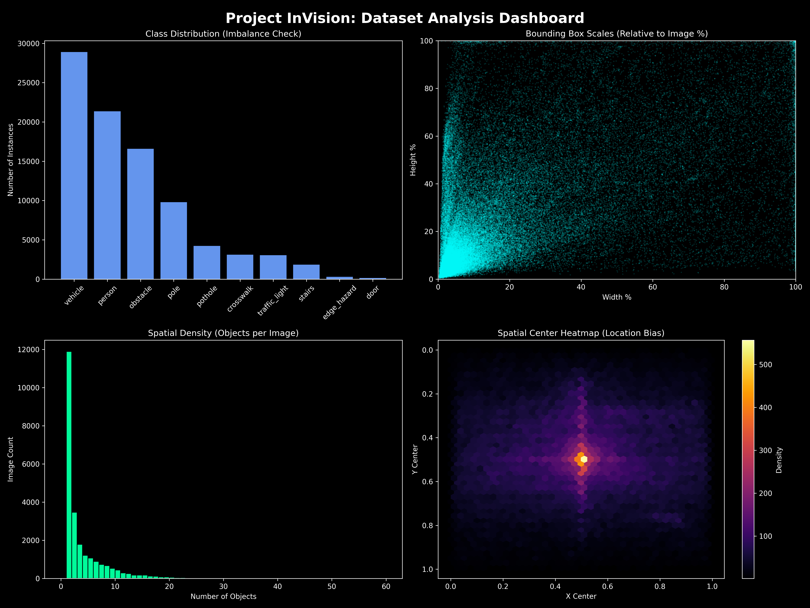

# Project InVision: Dataset Pipeline

This repository contains the core pipeline for building the unified **InVision Dataset**. It automates the extraction, cleaning, remapping, and merging of multiple Roboflow sources into a single, high-quality dataset optimized for YOLOv5 training.

## 📥 Dataset Sources
We aggregate and normalize data from the following Roboflow projects:
* [Pedestrian Obstacle Detection](https://universe.roboflow.com/pedestrianobstacle/pedestrianobstacledetection)
* [SafeWalkBD](https://universe.roboflow.com/safewalkbd/safewalkbd-l8jbn)
* [Vision-yjlv3](https://universe.roboflow.com/segmentation-vgo6s/vision-yjlv3)

---

## 🛠 How to Build the Dataset
Follow these steps in order to generate the final `merged/` directory and the distributable `.zip` archive.

### 1. Initial Setup
Place all raw Roboflow exports (YOLOv5 PyTorch format) into the `data/raw/` directory.

### 2. Extraction
Unzip all datasets into the intermediate `extracted/` directory.
```bash
python scripts/extract_datasets.py
````

### 3\. Polygon to Bounding Box Conversion

The **SafeWalkBD** dataset often uses polygons. This script calculates the tightest axis-aligned bounding box for every polygon to ensure compatibility with our detection model.

```bash
python scripts/convert_datasets.py
```

### 4\. Class Remapping & Normalization

We consolidate over 60 raw class names into **10 unified InVision classes**.

*Refer to `const.py` for the specific mapping logic and the `DROPPED_CLASSES` list.*

```bash
python scripts/remap_classes.py
```

### 5\. Final Merge

Merge the splits (train/valid/test) from all datasets and build the global `data.yaml`.

```bash
python scripts/merge_datasets.py
```

### 6\. Clean and Resize (Optimization)

Filter out images smaller than 200px and resize/letterbox everything to **640x640** to ensure consistency for the model.

```bash
python scripts/clean_and_resize.py --workers 8
```

### 7\. Dataset Analysis

Generate the statistical dashboard to verify class distribution, object scales, and spatial bias.

```bash
python scripts/analyze_dataset.py
```

### 8\. Package Build

Create the final distributable `.zip` archive for training (e.g., to upload to Colab or Drive).

```bash
python scripts/build.py --version 1
```

-----

## 📈 V1 Baseline Statistics

The following metrics represent the current state of our merged data:

  * **Class Distribution:** High imbalance (Person/Car dominated). Critical navigation hazards like potholes and stairs are minority classes.
  * **Scale Distribution:** Majority of objects are small (\<10% area); Mosaic augmentation is required during training.
  * **Spatial Heatmap:** Strong center-lower bias; translation augmentation is recommended to improve edge detection.

-----

## 📂 Directory Structure

  * `data/raw/`: Original zip files.
  * `data/extracted/`: Intermediate per-dataset folders.
  * `data/merged/`: The final unified dataset ready for training.
  * `scripts/`: Python implementation of the pipeline stages.
      * `const.py`: Central configuration and class mapping logic.

-----

## 📊 Dataset Analysis & Baseline (V1)

Before starting the training process, we analyze the unified dataset to identify potential biases or imbalances that could affect model performance.

### Class Merging Strategy
We consolidate over 60 raw class names from multiple sources into **10 unified InVision classes**. This mapping ensures the model focuses on the most critical navigation obstacles.



### Statistical Dashboard
The dashboard below provides a deep dive into the 25,000+ images currently in the `merged/` directory.



#### Key Observations:
* **Class Imbalance:** There is a significant dominant frequency of `person` and `car` labels. Minor classes like `pothole` and `stairs` represent less than 5% of the total annotations. 
    * *Strategy:* We will monitor V1 test results to see if these rare classes require synthetic augmentation (Copy-Paste) in V2.
* **Object Scale:** The scatter plot shows a high concentration of "small" objects (bottom-left). 
    * *Strategy:* Training will utilize **640px resolution** and **Mosaic Augmentation** to prevent these small hazards from being missed.
* **Spatial Bias:** The heatmap reveals a central "hotspot" for object centers. 
    * *Strategy:* We will enable **Translation Augmentation** (0.1) during training to force the model to look at the periphery of the frame.

---

### 🧠 Dataset Class Remapping & Ontology

To optimize **Project InVision** for real-time obstacle avoidance and navigation, we implement a **Class Remapping Protocol**. The original datasets (SafeWalkBD, PedestrianObstacleDetection, and Vision) contain highly granular labels that are computationally redundant for navigation logic. We consolidate these into **10 Functional Categories**.

#### The Strategy: Semantic Aggregation
Instead of the model trying to distinguish between a "car," "bus," and "tricycle," it identifies them all as a **`vehicle`**. This reduces the "cognitive load" on the model and focuses on the functional impact the object has on the pedestrian’s path.


#### Functional Mapping Breakdown

| Consolidated Class | Included Sub-Classes (Examples) | Navigation Logic |
| :--- | :--- | :--- |
| **`person`** | pedestrian, animal, person | Dynamic moving obstacle; require wide berth. |
| **`vehicle`** | car, bus, truck, bicycle, train | High-kinetic energy hazard; priority avoidance. |
| **`obstacle`** | roadblock, trash bin, chair, hydrant | Static ground-level blockage; route around. |
| **`pothole`** | drain, puddle, bad road | Negative space hazard; requires step-over or bypass. |
| **`pole`** | utility pole, sign pole | Vertical narrow obstacle; collision risk at head/shoulder level. |
| **`stairs`** | stair, over-bridge | Elevation change; transition from walking to climbing mode. |
| **`crosswalk`** | zebra cross, tactile paving, sidewalk | Safe zone / Navigational guide markers. |
| **`door`** | open_door, close_door | Access point; transition from outdoor to indoor. |
| **`traffic_light`**| stop sign, street sign, traffic signal | Rules of Engagement; determines "Go/No-Go" status. |
| **`edge_hazard`** | fence, railing | Boundary marker; indicates non-navigable drop-offs or walls. |


#### 3. Why This Improves Performance
* **Increased Training Stability:** By grouping "animal" into "person," we provide the model with more training examples for a single feature set, leading to the high **0.79 Precision** we see in our results.
* **Simplified Logic:** The navigation script doesn't need 40 `if` statements. It only needs to know if the path is blocked by a `vehicle` (high risk) or a `pothole` (ground risk).
* **Cross-Dataset Compatibility:** This map acts as a "Universal Translator," allowing us to combine three different datasets into one master training pipeline without label conflicts.
